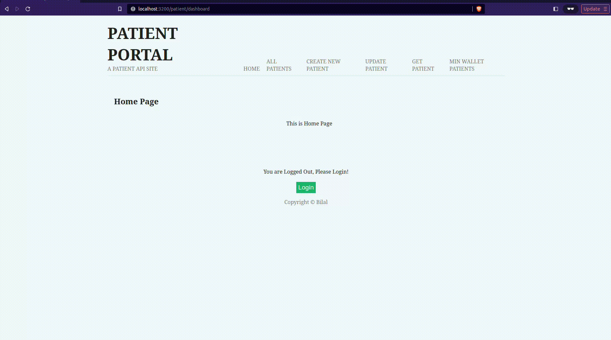

# Patient Portal
# Table of Contents

- [Introduction](#introduction)
- [GUI](#gui)
- [Features](#features)
    - [Usage](#usage)
    - [Tech](#tech)
- [Local Environment Setup](#local-environment-setup)
  - [Environment Variables](#environment-variables)
- [Contributing](#contributing)
- [License](#license)


## Introduction

- I have developed a Node.js web application that can be used by different hospitals to maintain patients’ data.
- I have implemented redis caching to improve application performance and reduce database costs.
- Session authentication allows only authenticated users to access the portal.

## GUI



## Features
### Usage
- Login Authentication
- Creating Patients
- Updating Patient
- Get Patient Data
- Get Patient List with wallet amount >= some amount x
### Tech
- User Authentication
- Redis Caching

## Local Environment Setup
1. Clone this Repository
    ```bash
    git clone https://github.com/crediblebilal/Patient-Portal.git
    cd Patient-Portal
    ```
    *You can also Fork the Repo and then clone from your account.*
3. Install required node modules
     ```bash
    npm install
    ```
4. Create necessary environment variables
        
    *I have stored environment variables in ```.env``` file in ```root``` folder, and inside ```/config/config.js``` and ```/config/dbCredentials.js```. Don't forget to add these to ```.gitignore``` file.*

     ### Environment Variables
    | Variable Name | Comment |
    | --------------| --------------|
    | PORT  | Port number on which the application runs on localhost  |
    | NODE_ENV  | Node environment like *development*, *test* |
    | REDIS_HOST  | hostname or IP address of your Redis server   |
    | REDIS_PORT | Port on REDIS_HOST on which redis starts  |
    | SESSION_MAX_AGE | Specifies the time (in milliseconds) in which the Session Expires |
    | SESSION_SECRET | This is the secret used to sign the session ID cookie |
    | DB_NAME | Name of the database in which tables are created |
    | DB_USERNAME | Username of the database user |
    | DB_PASSWORD | password for the DB_USERNAME |
    | DB_HOST | hostname or IP address of your database server |
    | DB_DIALECT | This parameter specifies the type of database you are using. Sequelize supports various database dialects like *mysql*, *postgres*, *sqlite* etc, and you should choose the one that matches your database. Like |

4. Start the Application
    ```bash
    npm run dev
    ```
## Contributing

Contributions are welcome! If you'd like to contribute to this project, follow these steps:
  1. Follow the above-mentioned [Environment Setup](#local-environment-setup).
  2. Create a new branch
  3. Commit your changes
  4. Push the branch
  5. Submit a pull request

  Feel free to [open an issue](https://github.com/crediblebilal/Patient-Portal/issues) if you have questions or need assistance.


## License

This project is licensed under the MIT License - see the [LICENSE](LICENSE) for details.
